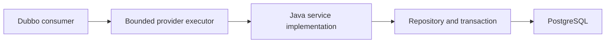

# rest-sample-dubbo-provider

[English](README.md) | [Türkçe](README.tr.md)

A plain Java Dubbo provider used by the Rust-Java REST consumer sample.

- It does not use Spring Boot.
- It can run without ZooKeeper.
- It can register itself in ZooKeeper.
- It can serve ready JSON or typed records.
- The full profile uses PostgreSQL and HikariCP.

Current versions: `rust-java-rest:4.3.0`, `java-rust-dubbo:0.7.1`, `rest-sample-utility:0.4.1`, `rust-sample-model:0.4.1`.

## Read This First

Package only the service surface this provider exports. A runtime property can disable behavior,
but it cannot remove already packaged Dubbo, database, model, or service classes.

| Copy | Replace in your provider |
| --- | --- |
| Maven profile split | Your catalog/query/command service groups |
| Shared interfaces and records | Your versioned wire contracts |
| Bounded interface/method executor settings | Limits measured against your DB and CPU capacity |
| Hikari and transaction boundaries | Your datasource, SQL, indexes, and idempotency rules |
| Optional ZooKeeper registration | Your deployment discovery model |

The POM inherits `rust-java-platform-parent` for aligned Java, library, processor, and build-gate
versions. The provider deliberately does not use a REST starter. Maven profiles physically select
the provider surface before packaging, and the shaded JAR excludes build-only processor metadata.

## What 0.6.1 Aligns

- Full, catalog-only, and DB-query-only artifacts stay isolated Maven profiles.
- Workspace Docker builds install the exact aligned REST and Dubbo artifacts before packaging.
- The provider remains plain Java and keeps explicit service registration.
- Provider interfaces, SQL behavior, HikariCP settings, and optional ZooKeeper registration are
  unchanged.

## Explicit Provider Flow

| You own | Shared library owns | Runtime rule |
| --- | --- | --- |
| Service implementation and business rules | Interface and record contracts | Consumer and provider use the same contract version |
| Repository SQL and transaction boundary | Generated JDBC record mapper where selected | No reflective row mapping |
| HikariCP limits | Provider bootstrap helpers | DB capacity remains explicit |
| Per-interface and per-method concurrency | Bounded service executor | One slow method cannot consume unbounded threads |
| Static or ZooKeeper registration choice | Registry adapter | ZooKeeper is not required for static Service DNS consumers |



The provider stays plain Java. It does not move business logic into Rust. Select a smaller Maven
profile when the process does not need customer commands or database access; runtime properties
cannot remove classes already packaged in a full artifact.

## Start Here

Choose one provider shape.

| Need | Maven profile | Includes |
|---|---|---|
| Small ready-JSON catalog provider | `catalog-static-provider` | One catalog interface; no DB and no ZooKeeper |
| Read-only PostgreSQL provider | `db-query-provider` | Customer queries and HikariCP; no commands |
| Catalog, queries, and commands | `full-provider` | Full sample; active by default |

Do not package the full provider when the service only needs one catalog method. The smaller profile loads fewer classes and uses less memory.

## Quick Start

### Option A: Small catalog provider

Run from this repository:

```powershell
$env:GITHUB_PACKAGES_TOKEN="YOUR_TOKEN_WITH_READ_PACKAGES"

mvn -q -Pcatalog-static-provider clean package

java `
  "-Ddubbo.provider.host=127.0.0.1" `
  "-Ddubbo.provider.bind-host=127.0.0.1" `
  "-Ddubbo.provider.port=20880" `
  "-Dreactor.dubbo.registry-enabled=false" `
  -jar target/rest-sample-dubbo-provider-0.6.1.jar
```

Use it with the consumer's `native-static-consumer` profile.

### Option B: Full provider with PostgreSQL

Start PostgreSQL:

```powershell
docker rm -f rs-provider-postgres-test 2>$null

docker run -d --name rs-provider-postgres-test `
  -e POSTGRES_DB=reactor_sample `
  -e POSTGRES_USER=reactor `
  -e POSTGRES_PASSWORD=reactor `
  -p 15432:5432 postgres:16-alpine
```

Build and start the provider:

```powershell
$env:GITHUB_PACKAGES_TOKEN="YOUR_TOKEN_WITH_READ_PACKAGES"

mvn -q clean package

java `
  "-Dreactor.dubbo.registry-enabled=false" `
  "-Dsample.db.jdbc-url=jdbc:postgresql://127.0.0.1:15432/reactor_sample" `
  "-Dsample.db.username=reactor" `
  "-Dsample.db.password=reactor" `
  "-Dsample.db.schema-init=true" `
  "-Dsample.db.warmup=true" `
  -jar target/rest-sample-dubbo-provider-0.6.1.jar
```

The provider listens on `127.0.0.1:20880`.

Start the consumer with:

```properties
sample.dubbo.discovery=static
reactor.dubbo.providers=127.0.0.1:20880
```

## What the Provider Exposes

The provider does not expose HTTP endpoints. It exports Dubbo interfaces.

| Interface | Example methods | Data shape |
|---|---|---|
| `CatalogJsonService` | `getNestedCatalogJson()` | Ready JSON `byte[]` |
| `NestedCatalogService` | title, count, info, item list, attributes | String, primitive, record, list, map |
| `CustomerQueryService` | customer, segment list, stats, exists | Ready JSON and typed results |
| `CustomerCommandService` | create, patch, delete | JSON bytes and typed command records |

The shared interface package must stay `com.reactor.rust.dubbo.sample`. Dubbo uses the full interface name as the service identity.

## Static Address or ZooKeeper?

### Without ZooKeeper

Use this when the consumer reaches the provider through a known address or Kubernetes Service DNS.

```properties
reactor.dubbo.registry-enabled=false
dubbo.provider.bind-host=0.0.0.0
dubbo.provider.port=20880
```

Kubernetes example:

```text
rest-sample-dubbo-provider:20880
```

The Service can point to one or many provider pods.

### With ZooKeeper

Use this when the provider must register itself in a Dubbo registry.

```properties
reactor.dubbo.registry-enabled=true
reactor.dubbo.registry-address=zookeeper://zookeeper-client.platform.svc.cluster.local:2181
reactor.dubbo.registry-root=dubbo
```

ZooKeeper is optional. Do not enable it only because the provider uses Dubbo.

## Database and Concurrency Limits

The default production shape is intentionally small:

```properties
sample.db.maximum-pool-size=2
sample.db.minimum-idle=0

dubbo.provider.executor.core-threads=1
dubbo.provider.executor.max-threads=8
dubbo.provider.executor.queue-capacity=16

dubbo.provider.service.CustomerQueryService.max-concurrent=2
dubbo.provider.service.CustomerCommandService.max-concurrent=2
dubbo.provider.service.CustomerCommandService.method.patchCustomerStatus.max-concurrent=1
```

Why:

1. HikariCP has two database connections.
2. Query and command concurrency stays close to real DB capacity.
3. Same-row updates run one at a time.
4. A bounded queue prevents unlimited memory growth.

Increase the DB pool and service limits together. First check PostgreSQL CPU, connection count, lock wait, and query latency.

Do not increase only the queue. That delays failures and usually slows the worst requests.

## JSON and DTO Choice

| Need | Provider return type | Result |
|---|---|---|
| Consumer forwards JSON without reading fields | `byte[]` containing UTF-8 JSON | Creates the fewest Java objects |
| Consumer needs one value | Primitive or `String` | Small typed contract |
| Consumer makes business decisions | Small immutable `record` | Clear contract with Hessian decode cost |
| Consumer forwards a large page | Ready JSON `byte[]` | Avoids a large record/list graph |

Typed DTO packages must be present on both sides and allowed by Hessian security:

```text
src/main/resources/security/serialize.allowlist
```

## Configuration

The application reads configuration in this order:

1. `src/main/resources/rest-sample-dubbo-provider.properties`
2. Files passed through `reactor.config.file` or `REACTOR_CONFIG_FILE`
3. JVM `-D...` values and supported environment variables

| File | Purpose |
|---|---|
| `rest-sample-dubbo-provider.properties` | Local provider, registry, service limit, and DB defaults |
| `config/production.properties` | Kubernetes bind address and low-memory HikariCP defaults |
| `config/advanced-tuning.properties` | Per-method limits and Netty/Dubbo memory controls |

Production should run database migrations outside this process:

```properties
sample.db.schema-init=false
```

The sample sets it to `true` only for an easy local start.

## Container Images

| Image definition | Use |
|---|---|
| `docker/images/Dockerfile.jlink.catalog-static` | Small catalog-only provider |
| `docker/images/Dockerfile.jlink.db-query` | PostgreSQL query-only provider |
| `docker/images/Dockerfile.jlink` | Full provider |
| `docker/images/Dockerfile` | Full Docker Compose provider |

See [`docker/images/README.md`](docker/images/README.md) before building a jlink image. Container builds also need Maven access to the private shared packages.

## Code Map

| File | Why it matters |
|---|---|
| `RestSampleDubboProviderApplication.java` | Starts the full provider |
| `CatalogStaticProviderApplication.java` | Starts the catalog-only provider |
| `DbQueryOnlyProviderApplication.java` | Starts the DB query-only provider |
| `*ProviderModule.java` | Declares exported services |
| `CustomerQueryServiceImpl.java` | DB read examples |
| `CustomerCommandServiceImpl.java` | DB command examples |
| `PostgresCustomerRepository.java` | SQL, transaction, and paging logic |
| `rest-sample-dubbo-provider.properties` | Local settings |

## Maven Package Access

GitHub Packages requires a token with `read:packages`. The token also needs access to the private shared sample repositories.

The server IDs in `~/.m2/settings.xml` must match the POM:

```xml
<servers>
  <server>
    <id>github-java-rust-dubbo</id>
    <username>YOUR_GITHUB_USERNAME</username>
    <password>${env.GITHUB_PACKAGES_TOKEN}</password>
  </server>
  <server>
    <id>github-rest-sample-utility</id>
    <username>YOUR_GITHUB_USERNAME</username>
    <password>${env.GITHUB_PACKAGES_TOKEN}</password>
  </server>
  <server>
    <id>github-rust-sample-model</id>
    <username>YOUR_GITHUB_USERNAME</username>
    <password>${env.GITHUB_PACKAGES_TOKEN}</password>
  </server>
</servers>
```

## Common Problems

| Symptom | Check |
|---|---|
| Maven returns `401` | Token, private repo access, and all server IDs |
| Port `20880` is unavailable | Another provider or container already uses it |
| Consumer cannot connect | Bind host, advertised host, port, Service DNS, and firewall |
| PostgreSQL connection fails | JDBC URL, `15432` port, username, and password |
| Typed DTO is rejected | Shared model version and `serialize.allowlist` |
| Some write requests are much slower | DB lock wait, Hikari pool wait, method limit, and same-row contention |

## Production Checklist

- Package the smallest Maven profile that exports the required interfaces.
- Keep consumer, provider, model, and utility contract versions aligned.
- Set provider advertised host separately from bind host when the platform requires it.
- Bound interface and method concurrency; keep it consistent with Hikari and database capacity.
- Use transactions and idempotency for commands; distinguish same-row contention from normal writes.
- Keep liveness local. Put short provider/database checks in readiness.
- Test consumer/provider startup, provider restart, c16/c64/c256 mixed methods, p99, errors, RSS, and DB pool wait.
- Enable ZooKeeper only when registration/discovery is required by the deployment model.

## Glossary

| Term | Meaning |
| --- | --- |
| Provider | Application that implements and exports Dubbo interfaces |
| Bind host | Local interface on which the provider listens |
| Advertised host | Address consumers receive and connect to |
| Interface limit | Shared concurrency boundary for all methods on one service |
| Method override | Smaller or different concurrency limit for one method |
| Pool wait | Time a request waits for a Hikari database connection |

## More Detail

- [Turkish user guide](docs/USER_GUIDE.tr.md)
- [Turkish PDF guide](docs/rest-sample-dubbo-provider-user-guide.tr.pdf)
- [Docker runbook](docker/README.md)
- [Production settings](src/main/resources/config/production.properties)
- [Advanced tuning](src/main/resources/config/advanced-tuning.properties)
- [v0.6.1 release notes](docs/RELEASE_NOTES_v0.6.1.md)
