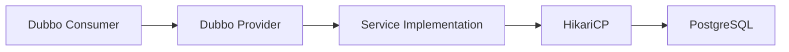

# rest-sample-dubbo-provider Kullanıcı Rehberi

Bu rehber ilk kullanım içindir.

Amaç kısa ve nettir: REST consumer'ın çağıracağı plain Java Dubbo provider'ı çalıştırmak.

## İçindekiler

1. [Bu Proje Ne İşe Yarar?](#bu-proje-ne-işe-yarar)
2. [Akış Nasıl Çalışır?](#akış-nasıl-çalışır)
3. [Ne Zaman Kullanılır?](#ne-zaman-kullanılır)
4. [Gerçek Hayat Senaryoları](#gerçek-hayat-senaryoları)
5. [Hızlı Başlangıç](#hızlı-başlangıç)
6. [Kopyala-Yapıştır Ayarlar](#kopyala-yapıştır-ayarlar)
7. [Provider Şekilleri](#provider-şekilleri)
8. [DB Ve Hikari Ayarları](#db-ve-hikari-ayarları)
9. [Concurrency Kuralı](#concurrency-kuralı)
10. [Sık Hatalar](#sık-hatalar)

## Bu Proje Ne İşe Yarar?

`rest-sample-dubbo-provider`, Dubbo service implementasyonlarını barındırır.

Spring Boot kullanmaz. REST API açmaz.

İster hazır JSON döner, ister PostgreSQL/Hikari üzerinden veri okuyup command işler.

## Akış Nasıl Çalışır?



Consumer sadece çağırır. DB bağlantısı provider içindedir.

## Ne Zaman Kullanılır?

| Senaryo | Bu proje uygun mu? | Neden |
|---------|--------------------|-------|
| Consumer Dubbo üzerinden veri alacak | Evet | Ana kullanım budur. |
| Hazır JSON provider lazım | Evet | Catalog static profile uygundur. |
| PostgreSQL query provider lazım | Evet | DB query profile uygundur. |
| REST endpoint açılacak | Hayır | REST consumer tarafında açılır. |
| DB write command işlenecek | Evet | Customer command service örneği vardır. |

## Gerçek Hayat Senaryoları

| Senaryo | Provider ne yapar? | Önerilen şekil |
|---------|--------------------|----------------|
| Katalog read | Hazır JSON üretir, DB kullanmaz. | `catalog-static-provider` |
| Müşteri listeleme | PostgreSQL'den müşteri listesi okur. | `db-query-provider` |
| Customer command | Create, patch, delete işlemlerini DB'ye yazar. | Default/full |
| K8s static servis | Consumer provider'a Service DNS ile gelir. | `registry-enabled=false` |
| ZooKeeper zorunlu | Provider kendini ZooKeeper'a register eder. | `registry-enabled=true` |

Provider tarafında en önemli kural şudur: DB kapasitesini burada koruyun.

Consumer daha çok request gönderse bile provider Hikari ve method limitleriyle sistemi sınırlar.

## Hızlı Başlangıç

PostgreSQL hazırsa provider'ı çalıştırın:

```powershell
mvn -q package
java -jar target/rest-sample-dubbo-provider-0.2.0.jar
```

Default local ayar ZooKeeper istemez:

```properties
reactor.dubbo.registry-enabled=false
dubbo.provider.host=127.0.0.1
dubbo.provider.port=20880
```

## Kopyala-Yapıştır Ayarlar

En küçük catalog provider:

```properties
reactor.dubbo.registry-enabled=false
dubbo.provider.service.default.max-concurrent=16
```

DB query provider:

```properties
sample.db.maximum-pool-size=2
sample.db.minimum-idle=0
dubbo.provider.service.CustomerQueryService.max-concurrent=2
dubbo.provider.service.CustomerQueryService.method.getDatabaseCustomersJson.max-concurrent=1
```

Command provider:

```properties
sample.db.maximum-pool-size=2
dubbo.provider.service.CustomerCommandService.max-concurrent=2
dubbo.provider.service.CustomerCommandService.method.createCustomer.max-concurrent=1
dubbo.provider.service.CustomerCommandService.method.patchCustomerSegment.max-concurrent=1
```

ZooKeeper registration:

```properties
reactor.dubbo.registry-enabled=true
reactor.dubbo.registry-address=zookeeper://zookeeper-client.platform.svc.cluster.local:2181
reactor.dubbo.registry-root=dubbo
```

## Provider Şekilleri

| Şekil | Ne açar? | Ne zaman kullanılır? |
|-------|----------|----------------------|
| `catalog-static-provider` | Sadece hazır catalog JSON | En küçük read-only provider |
| `db-query-provider` | Sadece DB query service | Command yoksa |
| Default/full | Catalog + customer query + command | Tüm sample endpoint'leri gerekiyorsa |

## DB Ve Hikari Ayarları

| Property | Ne işe yarar? | Başlangıç |
|----------|---------------|-----------|
| `sample.db.jdbc-url` | PostgreSQL bağlantı adresi | Ortama göre değişir. |
| `sample.db.maximum-pool-size` | Fiziksel DB connection üst limiti | `2` iyi başlangıçtır. |
| `sample.db.minimum-idle` | Boşta tutulacak connection sayısı | Low-RSS için `0`. |
| `sample.db.connection-timeout-ms` | Pool'dan connection bekleme süresi | Kısa tutun, DB yavaşsa ölçün. |
| `sample.db.schema-init` | Demo schema oluşturur | Production'da kapalı olmalıdır. |

## Concurrency Kuralı

Provider limitleri Hikari kapasitesiyle uyumlu olmalıdır.

| Interface | Property | Öneri |
|-----------|----------|-------|
| Query service | `dubbo.provider.service.CustomerQueryService.max-concurrent` | Hikari pool size veya daha düşük. |
| DB list method | `dubbo.provider.service.CustomerQueryService.method.getDatabaseCustomersJson.max-concurrent` | DB yavaşsa `1-2`. |
| Command service | `dubbo.provider.service.CustomerCommandService.max-concurrent` | Hikari pool size veya daha düşük. |
| Command method | `dubbo.provider.service.CustomerCommandService.method.createCustomer.max-concurrent` | Aynı key/write contention varsa `1`. |

Client tarafında `c64` yük gelmesi Hikari'nin 64 connection açacağı anlamına gelmez.

Hikari `2` ise aynı anda iki DB işi çalışır. Geri kalan iş kısa süre bekler veya fail-fast olur.

| Consumer baskısı | Provider Hikari | Doğru yorum |
|------------------|-----------------|-------------|
| `c64` | `2` | 64 request gelir, ama aynı anda 2 DB işi çalışır. |
| `c256` | `4` | 256 request DB'ye aynı anda girmez. Queue ve bulkhead devrededir. |
| `balanced-wide` | `2` | Risklidir. Queue büyüyebilir, p99/RSS artabilir. |
| `micro-1x1` | `1-2` | Memory ve DB güvenliği için doğru başlangıçtır. |

## Sık Hatalar

| Belirti | Muhtemel neden | Çözüm |
|---------|----------------|-------|
| Consumer `provider unavailable` alıyor | Provider kapalı veya adres yanlış. | Host, port ve static/ZooKeeper ayarlarını kontrol edin. |
| DB wait artıyor | Hikari pool dolu. | Önce SQL ve index kontrol edin, sonra pool artırın. |
| p99 saniyelere çıkıyor | Queue fazla büyüdü. | Provider method limitlerini DB kapasitesine indirin. |
| RSS yüksek | Full provider yüzeyi gereksiz olabilir. | `catalog-static-provider` veya `db-query-provider` kullanın. |
